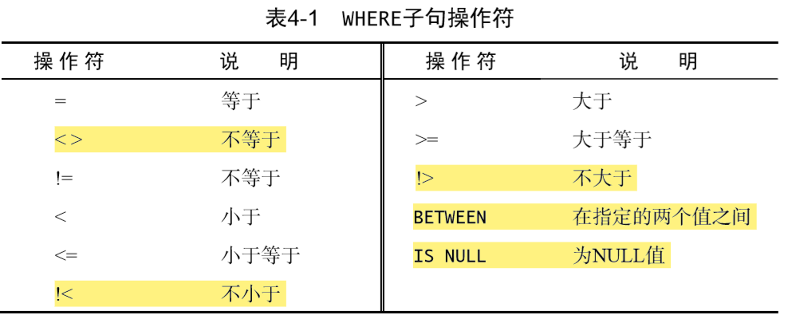
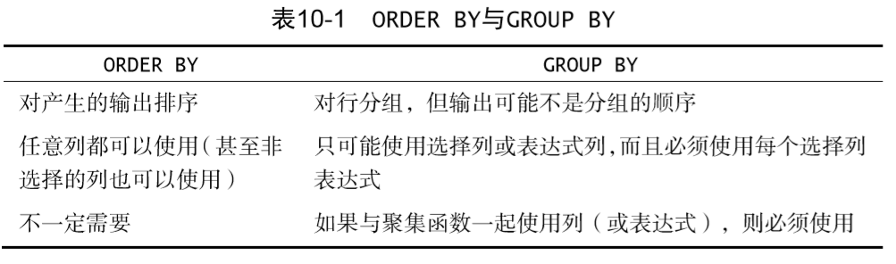
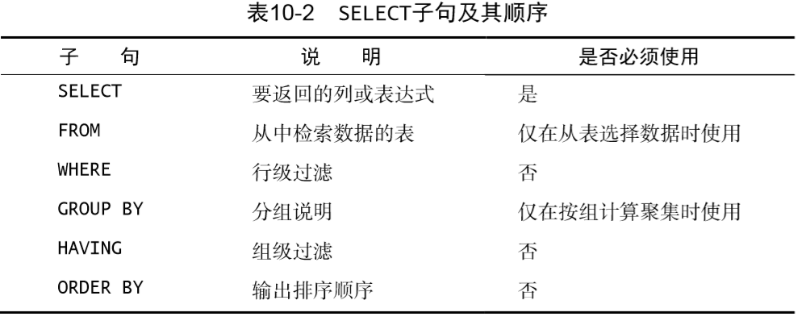

## 了解SQL

### 数据库基础

#### 数据库

保存有组织的数据的容器（通常是一个文件或一组文件）。 

> 数据库软件应称为数据库 管理系统（DBMS）。数据库是通过 DBMS 创建和操纵的容器，而具 体它究竟是什么，形式如何，各种数据库都不一样。 

#### 表

- 表
	某种特定类型数据的结构化清单。 
	存储在表中的数据是**同一种**类型的数据或清单
	
- 表名
	数据库中的每个表都有一个名字来标识自己。这个名字是**唯一**的，即数 据库中没有其他表具有相同的名字。 
	
- 模式
	关于数据库和表的布局及特性的信息

#### 列

表中的一个字段。所有表都是由一个或多个列组成的
> 正确地将数据分解为多个列极为重要。例如，城市、州、邮政编码 应该总是彼此独立的列。
> 
> 通过分解这些数据，才有可能利用特定的 列对数据进行分类和过滤（如找出特定州或特定城市的所有顾客）
> 

#### 数据类型

所允许的数据的类型。每个表列都有相应的数据类型，它限制（或允 许）该列中存储的数据。 

> 数据类型及其名称是 SQL不兼容的一个主要原因
> 

#### 行

表中的一个记录。

> 你可能听到用户在提到行时称其为数据库记录（record）。这两个术语 多半是可以交替使用的，但从技术上说，行才是正确的术语。
> 

#### 主键

一列（或一组列），其值能够**唯一**标识表中每一行。 

> 应该总是定义主键 
> 

表中的任何列都可以作为主键，只要它满足以下条件： 
- 任意两行都不具有相同的主键值； 
- 每一行都必须具有一个主键值（主键列不允许 NULL 值） ； 
- 主键列中的值不允许修改或更新； 
- 主键值不能重用（如果某行从表中删除，它的主键不能赋给以后的新行）。

主键通常定义在表的一列上，也可以一起使用多 个列作为主键。
在使用多列作为主键时，上述条件必须应用到所有列， 所有列值的组合必须是唯一的（但单个列的值可以不唯一）。 

### SQL

SQL（发音为字母 S-Q-L或 sequel）是Structured Query Language（结构 化查询语言）的缩写。SQL是一种专门用来与数据库沟通的语言。 

## 检索数据

### SELECT

- 语法
```mysql
SELECT prod_id, prod_name, prod_price 
FROM Products; 
```

所需的列名写在 SELECT 关键字之后，列名之间必须以逗号分隔。FROM 关键字指出从哪个表 中检索数据。

> 多条 SQL语句必须以分号（；）分隔
> 
> 在处理 SQL语句时，其中所有空格都被忽略。
> 
> 将 SQL语句分成多行更容易阅读和调试
> 
> 许多 SQL开发人员喜欢对 SQL关键 字使用大写，而对列名和表名使用小写，这样做使代码更易于阅读和 调试
> 

- 检索所有列
```mysql
SELECT * 
FROM Products; 
```

如果给定一个通配符（*），则返回表中所有列

缺点：检索不需 要的列通常会降低检索和应用程序的性能
优点：由于不明确指定列名（因为星号检索每一 列），所以能检索出名字未知的列。 

- 检索不同的值
```mysql
SELECT DISTINCT vend_id 
FROM Products; 
```
使用 DISTINCT 关键字，它指示数据库只返回不同的值，必须直接放在列名的前面

> DISTINCT 关键字作用于**所有**的列，不仅仅是跟在其后的那一列。
> 例 如，你指定 SELECT DISTINCT vend_id, prod_price，因为指定的 两列不完全相同，所以所有的行都会被检索出来。 
> 

- 限制输出数量
```mysql
SELECT prod_name 
FROM Products 
LIMIT 5;
```
LIMIT 5指示MySQL 等 DBMS返回不超过 5行的数据

为了得到后面的 5行数据，需要指定从哪儿开始以及检索的行数
```mysql
SELECT prod_name 
FROM Products 
LIMIT 5 OFFSET 5; 
```

> 第一个被检索的行是第 0行，而不是第 1行
> 简化版：LIMIT 3,4。逗号之前的值对应 OFFSET，逗号之后的值 对应 LIMIT。 
> 

### 注释

#### 用途
- 便于日后参考
-  SQL 文件开始处的内容，它可能包含程序员的联系方 式、程序描述以及一些说明
-  暂时停止要执行的 SQL代码。如果你碰到一 个长 SQL语句，而只想测试它的一部分，那么应该注释掉一些代码， 以便 DBMS将其视为注释而加以忽略

#### 示例
```mysql
单行注释
SELECT prod_name    -- 这是一条注释  FROM Products; 

多行注释
/* SELECT prod_name, vend_id  
FROM Products; */  
SELECT prod_name  FROM Products;
```

## 排序检索数据

### 排序数据

其实，检索出的数据并不是随机显示的。如果不排序，数据一般将以它在底层表中出现的顺序显示，这有可能是数据最初添加到表中的顺序。

> 关系数据库设计理论认为，如果不明确规定排序顺序，则不应该假定检索出的数据的顺序有任何意义。
> 

### ORDER BY

- ORDER BY 子句取一个或多个列的名字，据此对输出进行排序。

	- 示例
    ```mysql
    SELECT prod_id, prod_price, prod_name
    FROM Products
    ORDER BY prod_price, prod_name;
    ```

	- 在指定一条 ORDER BY 子句时，应该保证它是 SELECT 语句中**最后一条**子句。

	- 用于排序的数据不一定要是检索的列

	- 在按多个列排序时，排序的顺序完全按ORDER BY 语句中的顺序

- ORDER BY 还支持按相对列位置进行排序
	- 示例
	```mysql
	SELECT prod_id, prod_price, prod_name 
	FROM Products 
	ORDER BY 2, 3;
	```
	
	ORDER BY 2， 3 表示先按 prod_price，再按 prod_name 进行排序
	
	这一技术的主要好处在于不用重新输入列名。但它也有缺点。
	- 首先，不明 确给出列名有可能造成错用列名排序。
	- 其次，在对 SELECT 清单进行更改 时容易错误地对数据进行排序（忘记对 ORDER BY 子句做相应的改动）。 
	- 最后，如果进行排序的列不在 SELECT 清单中，显然不能使用这项技术。

- 排序方向

	为了进行降序排序， 必须指定 DESC 关键字。

    ```mysql
    SELECT prod_id, prod_price, prod_name 
    FROM Products 
    ORDER BY prod_price DESC, prod_name;
    ```

	DESC关键字只应用到直接位于其前面的列名，如果想在多个列上进行降序排序，必须对每一列指定 DESC 关键字。 
	
	如果既不指定 ASC 也不指定 DESC，则假定为 ASC。
	
	> 在字典（dictionary）排序顺序中，A 被视为与 a 相同，这是大多数数 据库管理系统的默认行为。
	> 
	> 如果确实需要改变这种排序顺序，用简单的 ORDER BY 子句可能做不到。你必须请求数据库管理员的帮助。 
	> 

## 过滤数据

### WHERE子句

- 语法
在 SELECT 语句中，数据根据 WHERE 子句中指定的搜索条件进行过滤。 
WHERE 子句在表名（FROM 子句）之后给出

- 示例
```mysql
SELECT prod_name, prod_price 
FROM Products 
WHERE prod_price BETWEEN 5 AND 10; 
```

> SQL 过滤与应用过滤
> 
> 优化数据库后可以更快速有效地对数据进 行过滤。而让客户端应用（或开发语言）处理数据库的工作将会极大 地影响应用的性能，并且使所创建的应用完全不具备可伸缩性。
> 
> 此外， 如果在客户端过滤数据，服务器不得不通过网络发送多余的数据，这 将导致网络带宽的浪费
> 



- 空值检查

在一个列不 包含值时，称其包含空值 NULL。
它与字段包含 0、空字符串或仅仅包含空格不同。

确定值是否为 NULL，不能简单地检查是否= NULL。SELECT 语句有一个 特殊的 WHERE 子句——**IS NULL** 子句，可用来检查具有 NULL 值的列。

> 通过过滤选择不包含指定值的所有行时，你可能希望返回含 NULL 值 的行。
> 
> 但是这做不到。因为未知（unknown）有特殊的含义，数据库不知道它们是否匹配，所以在进行匹配过滤或非匹配过滤时，不会返回这些结果。
>  
> 过滤数据时，一定要验证被过滤列中含 NULL 的行确实出现在返回的 数据中。 
> 

## 高级数据过滤

- AND

    示例

    ```mysql
    SELECT prod_id, prod_price, prod_name 
    FROM Products 
    WHERE vend_id = 'DLL01' AND prod_price <= 4; 
    ```

    > 可以增加多 个过滤条件，每个条件间都要使用 AND 关键字
    > 

- OR

    许多 DBMS在 OR WHERE 子句的第一个条件得到满足的情 况下，就不再计算第二个条件了

    示例

    ```mysql
    SELECT prod_name, prod_price 
    FROM Products 
    WHERE vend_id = 'DLL01' OR vend_id = ‘BRS01’; 
    ```

- 求值顺序

    SQL（像 多数语言一样）在处理 OR 操作符前，优先处理 AND 操作符。

    任何时候使用具有 AND 和 OR 操作符的 WHERE 子句，都应该使用圆括 号明确地分组操作符。

- IN

	IN 操作符用来指定条件范围，范围中的每个条件都可以进行匹配。IN 取 一组由逗号分隔、括在圆括号中的合法值。（和Python用法相似）

	优点：
	- 在有很多合法选项时，IN 操作符的语法更清楚，更直观。 
	- 在与其他 AND 和 OR 操作符组合使用 IN 时，求值顺序更容易管理。 
	- IN 操作符一般比一组 OR 操作符执行得更快。
	- IN 的最大优点是可以包含其他 SELECT 语句，能够更动态地建立 WHERE 子句。

- NOT

    WHERE 子句中的 NOT 操作符有且只有一个功能，那就是否定其后所跟的 任何条件

    NOT 关键字可以用在要过滤的列前， 而不仅是在其后。

    与 IN 操作符联合使用时，NOT 可以非常简单地找出与条件列表不匹配 的行。 

## 用通配符进行过滤

### LIKE

#### 百分号（%）通配符 

在搜索串中，%表示任何字符出现任意次数。

- 示例

```mysql
SELECT prod_id, prod_name  
FROM Products  
WHERE prod_name LIKE '%bean bag%'; 
```

通配符一般放在搜索模式的首尾

有一种情况下把通配符放在搜索模式中间是很有用的，就是根据邮件 地址的一部分来查找电子邮件

>通配符%看起来像是可以匹配任何东西，但有个例外，这就是 NULL。 子句 WHERE prod_name LIKE '%'不会匹配产品名称为 NULL 的行。 
>

#### 下划线（_）通配符 

下划线的用途与%一样，但它只匹配 单个字符，而不是多个字符，不能多也不能少。

#### 方括号（[ ]）通配符 

> mysql不支持[]
> 

方括号（[]）通配符用来指定一个字符集，它必须匹配指定位置（通配 符的位置）的一个字符。 

此通配符可以用前缀字符^（脱字号）来否定。

```mysql
SELECT cust_contact 
FROM Customers 
WHERE cust_contact LIKE '[^JM]%' ORDER BY cust_contact; 
```

### 技巧

- 通配符搜索一般比前面讨论的其他搜索要耗费更长的处理时间
- 不要过度使用通配符。如果其他操作符能达到相同的目的，应该使用 其他操作符。 
- 在确实需要使用通配符时，也尽量不要把它们用在搜索模式的开始 处。把通配符置于开始处，搜索起来是最慢的。
- 仔细注意通配符的位置。如果放错地方，可能不会返回想要的数据。 

## 创建计算字段

### 痛点

- 存储在数据库表中的数据一般不是应用程序所需要的格式
- 我们需要直接从数据库中检索出转换、计算或格式化过的数据，而不是检索出数据，然后再在客户端应用程序中重新格式化。

> 只有数据库知道 SELECT 语句中哪些列是实际的表列， 哪些列是计算字段。
> 从客户端（如应用程序）来看，计算字段的数据与其他列的数据的返回方式相同。 
>
> 在数据库服务器上完成格式化工作比客户端中完成要快得多

### 拼接字段

- 拼接（concatenate） 
  将值联结到一起（将一个值附加到另一个值）构成单个值。 

  - 示例

    ```mysql
    SELECT Concat(vend_name, ' (', vend_country, ')') 
    FROM Vendors 
    ORDER BY vend_name; 
    ```

- 结合成一个计算字段的两个列用空格填充。
  许多数据库（不是所有）保存填充为列宽的文本值

  大多数 DBMS都支持 RTRIM()（去掉字符串右边的空格）、LTRIM()（去掉字符串左边的空格）以及 TRIM()（去掉字符串左右两边的空格）。 

- 使用别名

  拼接得到的新计算列实际上没有名字，无法用于客户端
  为了解决这个问题，SQL 支持列别名。别名（alias）是一个字段或值的 替换名。
  别名用 AS 关键字赋予。

  - 示例

  ```mysql
  SELECT Concat(vend_name, ' (', vend_country, ')')        
  AS vend_title  
  FROM Vendors 
  ORDER BY vend_name; 
  ```

  别名可用于在实际的表列名包含不合法的字符（如空格）时重新命名，在原来的名字含混或容易误解时扩充。

  > 在很多 DBMS 中，AS 关键字是可选的，不过最好使用它
  >
  > 别名最常见的使用是将多个单词的列名重命名为一个单词的名字

### 执行算术计算

- 示例

```mysql
SELECT 	prod_id,
		quantity,
		item_price,       
		quantity*item_price AS expanded_price FROM OrderItems
WHERE order_num = 20008; 
```

> 仅支持加减乘除和圆括号

### 测试计算

省略了 FROM 子句后就是简单地访问和 处理表达式，例如 SELECT 3 * 2;将返回6，SELECT Trim(' abc '); 将返回 abc，SELECT Now();使用 Now()函数返回当前日期和时间。

## 使用函数处理数据

### 不可移植
与SQL语句不一样，SQL函数不是可移植的
如果你决定使用函数，应该保证做好代码注释，以便以后你（或其他人）能确切地知道所编写的SQL代码的含义。

### SOUNDEX
SOUNDEX 是一个将任何文 本串转换为描述其语音表示的字母数字模式的算法。
SOUNDEX 考虑了类似的发音字符和音节，使得能对字符串进行发音比较而不是字母比较。
- 示例
```mysql
SELECT cust_name, cust_contact 
FROM Customers 
WHERE SOUNDEX(cust_contact) = SOUNDEX('Michael Green'); 
```


因为 Michael Green 和 Michelle Green 发音相似，所以它们的 SOUNDEX 值匹配，因此 WHERE 子句正确地过滤出了所需的数据。

### 常用函数


## 汇总数据

### 聚集函数

> 这些函数很高效，它们返回结果一般比你在自 己的客户端应用程序中计算要快得多。 
> 

#### AVG()

AVG()通过对表中行数计数并计算其列值之和，求得该列的平均值。AVG() 可用来返回所有列的平均值，也可以用来返回特定列或行的平均值。 

#### COUNT()

- 使用 COUNT(*)对表中行的数目进行计数，不管表列中包含的是空值 （NULL）还是非空值
- 使用 COUNT(column)对特定列中具有值的行进行计数，忽略 NULL 值

#### MAX()

MAX()返回指定列中的最大值。MAX()要求指定列名

#### MIN()

MIN()的功能正好与 MAX()功能相反，它返回指定列的最小值

#### SUM()

SUM()用来返回指定列值的和（总计）。 

### 聚集不同值

- 对所有行执行计算，指定 ALL 参数或不指定参数（因为 ALL 是默认行 为）。 
- 只包含不同的值，指定 DISTINCT 参数
	
	> DISTINCT 不能用于 COUNT(*) 
	> 

### 组合聚集函数

示例

```mysql
SELECT COUNT(*) AS num_items,        
	   MIN(prod_price) AS price_min,        
	   MAX(prod_price) AS price_max,        
	   AVG(prod_price) AS price_avg 
FROM Products; 
```

## 分组数据

### 数据分组

分组是使用 SELECT 语句的 GROUP BY 子句建立的。

规定：
- GROUP BY 子句可以包含任意数目的列，因而可以对分组进行嵌套， 更细致地进行数据分组。 
- 如果在 GROUP BY 子句中嵌套了分组，数据将在后指定的分组上进 行汇总。换句话说，在建立分组时，指定的所有列都一起计算（所以 不能从个别的列取回数据）。 
- GROUP BY 子句中列出的每一列都必须是检索列或有效的表达式（但 不能是聚集函数）。如果在 SELECT 中使用表达式，则必须在 GROUP BY 子句中指定相同的表达式。不能使用别名。 
- 大多数 SQL实现不允许 GROUP BY 列带有长度可变的数据类型（如文 本或备注型字段）。 
- 除聚集计算语句外，SELECT 语句中的每一列都必须在 GROUP BY 子句 中给出。 
- 如果分组列中包含具有 NULL 值的行，则 NULL 将作为一个分组返回。 如果列中有多行 NULL 值，它们将分为一组。 
- GROUP BY 子句必须出现在 WHERE 子句之后，ORDER BY 子句之前。 

### 过滤分组

目前为止所学过的 所有类型的 WHERE 子句都可以用 HAVING 来替代。唯一的差别是，WHERE 过滤行，而 HAVING 过滤分组。

WHERE和HAVING是可以同时使用的
```mysql
SELECT vend_id, COUNT(*) AS num_prods
FROM Products 
WHERE prod_price >= 4 
GROUP BY vend_id 
HAVING COUNT(*) >= 2; 
```

### 分组和排序



一般在使用 GROUP BY 子句时，应该也给出 ORDER BY 子句。这是保 证数据正确排序的唯一方法。千万不要仅依赖 GROUP BY 排序数据。 

### SELECT字句顺序




